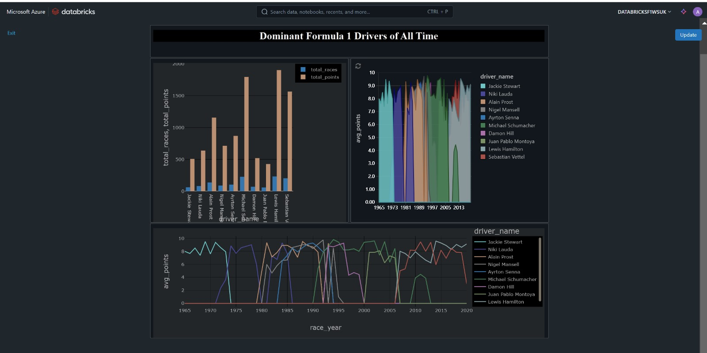
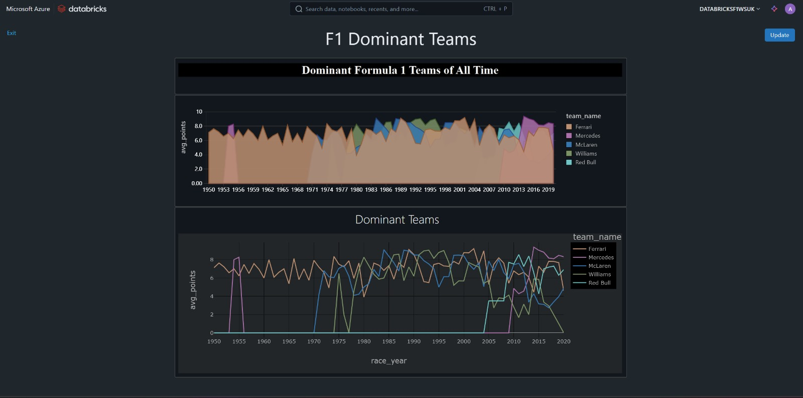

# Formula 1 Performance Analytics Engine

A end-to-end data engineering project built on **Azure Databricks**, processing Formula 1 racing data through a full Lakehouse architecture — from raw ingestion to interactive dashboards.

---

## Architecture Overview

Raw F1 data → **Azure Data Lake Gen2** → **Azure Databricks** (PySpark + Spark SQL) → **Delta Lake** (Bronze/Silver/Gold) → **Power BI**

Pipeline orchestration is handled via **Azure Data Factory**, with secrets managed through **Azure Key Vault**.

---

## Tech Stack

| Layer | Technology |
|---|---|
| Processing | Azure Databricks, PySpark, Spark SQL |
| Storage | Azure Data Lake Gen2 |
| Table Format | Delta Lake |
| Orchestration | Azure Data Factory |
| Governance | Unity Catalog |
| Visualization | Power BI |

---

## Project Structure

```
Formula1/
├── ingestion/          # Raw data ingestion notebooks (circuits, races, drivers, results, etc.)
├── transformation/     # PySpark transformations → race results, standings
├── Incremental load/   # Delta Lake incremental load pattern (upserts, partitioning)
├── viz_layer/          # SQL queries powering Power BI dashboards
├── raw/                # Raw table DDLs
├── setup/              # ADLS mounting and access configuration
└── demo/               # Exploratory notebooks (joins, aggregations, Delta Lake features)
```

---

## Key Implementations

- **Full & Incremental Loads** — implemented both patterns using Delta Lake merge (upsert) logic
- **Lakehouse Architecture** — Bronze → Silver → Gold layer separation using Delta tables
- **Data Governance** — Unity Catalog for data lineage, access control, and discoverability
- **Pipeline Automation** — ADF pipelines trigger Databricks notebooks end-to-end on a schedule
- **Parameterized Notebooks** — reusable ingestion logic driven by configuration files

---

## Dashboards

### Drivers Dashboard


### Team Dashboard


---

## Setup

1. Create an Azure Databricks workspace and ADLS Gen2 storage account
2. Configure secrets in Azure Key Vault and link to Databricks secret scope
3. Mount ADLS containers using `setup/8.mount_adls_containers_for_project.py`
4. Run ingestion notebooks under `ingestion/` to populate the Bronze layer
5. Execute transformation notebooks to build Silver and Gold layers
6. Import ADF pipeline templates to automate the workflow
7. Connect Power BI to Databricks SQL warehouse for visualization

---

## Skills Demonstrated

`PySpark` `Spark SQL` `Delta Lake` `Azure Data Lake` `Azure Data Factory` `Unity Catalog` `Incremental Data Loading` `Lakehouse Architecture` `Data Pipeline Orchestration` `Power BI`
